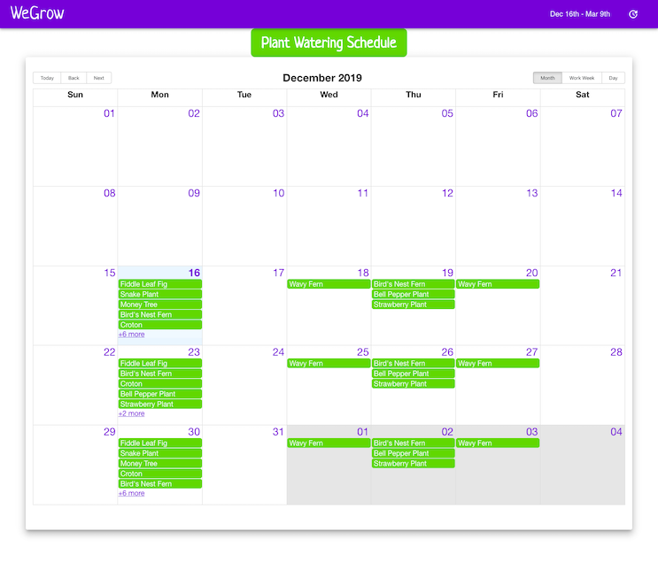
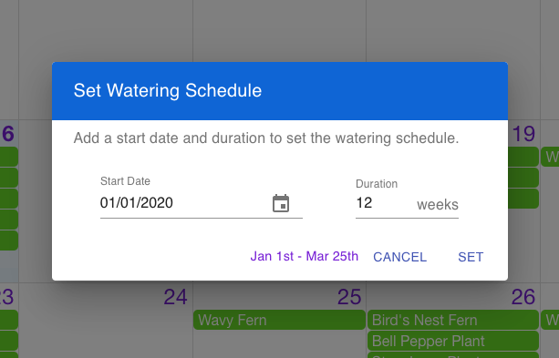
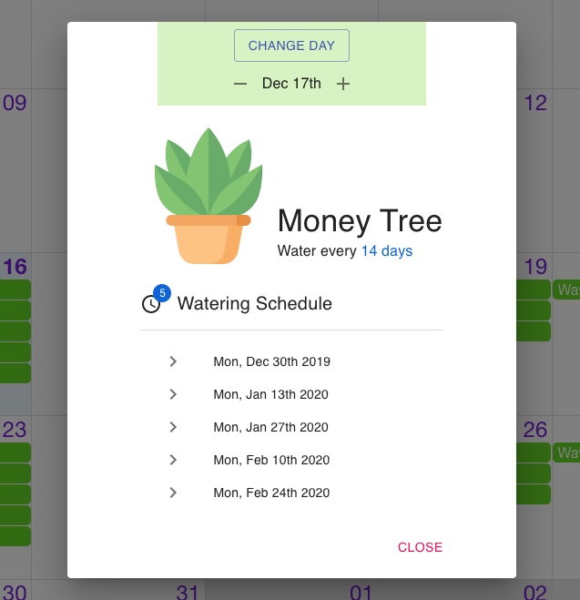

# WeGrow App

The idea for this project came from a [Tandem](https://madeintandem.com/) code challenge.

## Table of contents

- [About](#about)
- [Code Challenge](#code-challenge)
- [Installation](#installation)
- [How to use](#how-to-use)
- [To-do](#to-do)
- [Issues](#issues)
- [Credits](#credits)
- [License](#license)

## About

WeGrow takes your plants and their desired watering times and generates an optimal watering schedule (no weekends in the current setup). This schedule is presented in an easy to read calendar view - with Month, Week, and Day viewing options.

WeGrow also allows you to adjust the Schedule Start and Duration. Specific plant watering days can be moved as well.

This project was bootstrapped with [Create React App](https://github.com/facebook/create-react-app), using npm v6.13.3.

**WeGrow App** is live on [Netlify](https://netlify.com/):

[https://we-grow.netlify.com/](https://we-grow.netlify.com/)



## Code Challenge

### Goal

Your goal is to create an application that generates a watering schedule for the next 12 weeks for all of
our plants.
Use creative license in terms of how you want us to see this schedule. At minimum, the plant caretaker
looking at the schedule should be able to easily identify which plants to water on a particular date.

### Assumptions

- We do not water our plants on a weekend. Work-life balance is important, and we shouldn't be in
  the office on a weekend.
- Our plants are reasonably tolerant and will still be happy if they are watered a day before or after
  the day they should be watered.
- Watering an individual plant takes no time at all so you don't have to worry about how many
  plants can be watered in a particular day.
- The scheduling should start from next Monday and last for 12 weeks.
- All plants will be watered on the first day of the schedule (next Monday).
- We recognize that when to water a plant is heavily dependent on other factors such as soil,
  weather, humidity, etc. You can assume that we know exactly when to water these specific plants.
- You have been provided a JSON file which contains data for our plants.

### Acceptance Criteria

- [x] The user can view which plant(s) to water on which date(s).
- [x] The schedule covers the next 12 weeks starting next Monday.
- [x] No plants are watered on Saturdays or Sundays.
- [x] Each plant is watered on its desired schedule or as close as possible, taking into account weekends.

## Installation

You’ll need to have Node >= 8.10 and npm >= 5.6 on your machine.

```bash
# Clone this repository
$ git clone https://github.com/benjaminsinaiko/we-grow-in-tandem.git

# Go into the repository
$ cd we-grow-in-tandom

# Install dependencies
$ npm install

# Run the app
$ npm start

# If a new page doesn't open go to http://localhost:3000/ to see your app.
```

## How To Use

The app comes loaded with the initial plant data - with a start date of Dec 16th, 2019 and a watering duration of 12 weeks. This schedule can be updated by clicking on the update icon on the right side of the Navbar. Start date and duration can be amended.



If a plant watering day gets missed, or needs to be rescheduled, the scheduled day can be adjusted from the plant info display. Adjust the day, select CHANGE DAY, and the schedule for the specific plant updates.



## To-do

- Add persistent state, either local storage or db, for retaining schedule start/end and specific plant dates
  -Improve logic for changing plant watering days
- Add a form to add new plants, with name and water schedule
- Incorporate a plant data api for images and plant information
- Add unit tests
- Optimize component rendering

## Issues

- For short watering durations, the app will allow you to change a plants schedule beyond the maximum days between, up until a weekend. Need to fix that logic
- Not all calendar views optimized for mobile
- No persistent state. Updated schedule and specific plant watering days will be lost with page refresh

## Credits

WeGrow uses the following open source packages:

- [React](https://reactjs.org/)
- [React Big Calendar](http://intljusticemission.github.io/react-big-calendar/examples/index.html)
- [Material UI](https://material-ui.com/)
- [Material UI - Pickers](https://material-ui-pickers.dev/)
- [uuid](https://github.com/kelektiv/node-uuid#readme)

## License

This project is licensed under the terms of the
[MIT license](/LICENSE).
